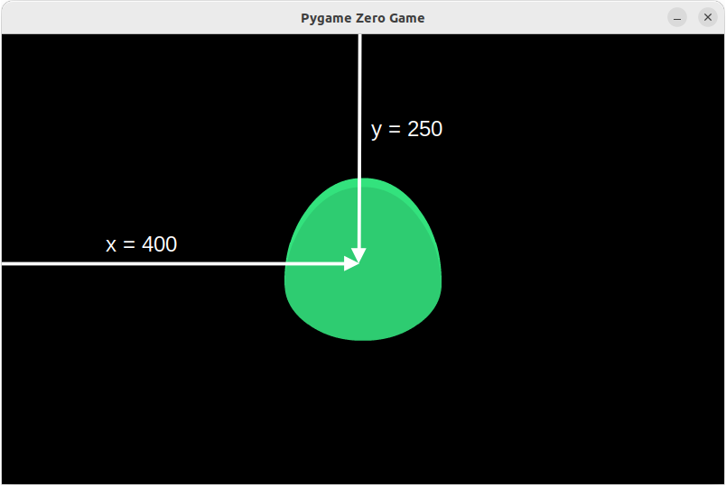
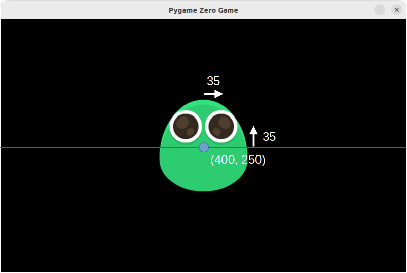

# Make a Monster

This is part one of an introduction to [Pygame Zero](https://pygame-zero.readthedocs.io/en/stable/) and it will introduce:

* Creating a window
* Creating and positioning sprites (**Actors**)
* Detecting keyboard inputs

## Create the window

Open your Python editor and create a new program. The recommended editor is
[Thonny](https://thonny.org/) but others are availble.

In your new program window type in the Pygame Zero Starter:

```python
# This line must be at the top
import pgzrun

WIDTH = 800
HEIGHT = 500

# This line must be at the bottom
pgzrun.go()
```

If you are using Thonny it is possible to turn on 'Pygame Zero' mode. If you do
this then the first line, `import pgzrun`, and last line, `pgzrun.go()`, are not
required.

When you run this program a new window will appear. The values of `WIDTH` and
`HEIGHT` set how big it is. You can try different values to get the size you
want.

> [!NOTE]
> When you run this you may see a warning saying that the `draw function is
> missing`. Do not worry about this - it will be fixed in the next part.

## Your monster's body

Create your first sprite for the monster's body. Sprites in Pgzero are called
`Actor`s.

Add this to your program below the `WIDTH` and `HEIGHT`, and above `pgzrun.go()`.

```python
# Add this underneath "HEIGHT = 500"
body = Actor('bodies/yellow_d.png')
body.pos = (400, 250)

def draw():
    screen.clear()
    body.draw()
```

This code, and all other bits of code, needs to go after `import` at the top
and before the `pgzrun.go()` at the end.

The first line creates the new sprite and sets the image file to use. These
files are in the `images` directory, so you can have a look to see if there is
a body image that you prefer.

The next line defines the `pos` (position) attribute of the new sprite, which
is its position on the screen. The first number, 400, is the distance from the
left edge and the second number, 250, is the distance from the top. This is the
position of the **anchor** of the image, which is the middle. Later we will see
how a different point can be the anchor of an image.



Next is the `draw` function. This contains the code that needs to run each time
the screen will be redrawn and, for the moment, it is simply clearing the
screen and then drawing the body.

## Moving your monster

Above you created the `draw` function to draw everything on the screen. Now you
will create another function called `update` to change things about the
sprites. This will detect when you press the left button and move the monster
left:

```python
def update():
    if keyboard[keys.LEFT]:
        body.x -= 5
```

This will check to see if the left key is pressed each time the screen is
updated and then take 5 from the `x` position of the body.

Next, add the code to move right when you press the right button.

## Adding eyes to your monster

Your monster needs some eyes, and there are some eyes to choose from in the
`images/eyes` directory. Choose a pair and create a new sprite after where the
body is defined:

```python
leftEye = Actor('eyes/left_cute_light.png')
rightEye = Actor('eyes/right_cute_light.png')
```

To put the eyes in the right place their positions need to be set *relative to
the position of the body* and if this is done each time the body moves then
they will always be in the right place.



So, put the following lines inside the `update` function:

```python
    leftEye.pos = (body.x - 35, body.y - 35)
    rightEye.pos = (body.x + 35, body.y - 35)
```

> [!NOTE]
> Make sure that these line up with the `if` in the `update` function.

Finally, add the following lines to the `draw` function to make the eyes appear
in the window:

```python
    leftEye.draw()
    rightEye.draw()
```

> [!NOTE]
> Make sure that all the lines inside the `draw` function are all indented the
> same.

## Check your code

If everything has gone well your code should look something like this:

```python
import pgzrun

WIDTH = 800
HEIGHT = 500

body = Actor('bodies/yellow_d.png')
body.pos = (400, 250)
leftEye = Actor('eyes/left_cute_light.png')
rightEye = Actor('eyes/right_cute_light.png')

def draw():
    screen.clear()
    body.draw()
    leftEye.draw()
    rightEye.draw()

def update():
    if keyboard[keys.LEFT]:
        body.x -= 5
    if keyboard[keys.RIGHT]:
        body.x += 5
    leftEye.pos = (body.x - 35, body.y - 35)
    rightEye.pos = (body.x + 35, body.y - 35)

pgzrun.go()
```

> [!NOTE]
> Some things may not be exactly the same, especially if you chose a different
> body and different eyes. Also, it doesn't matter if the `draw` and `update`
> functions are the other way round.


## Complete your monster

In the `images` folder you will find more image files for noses, mouths, arms
and legs. Use these and what you have learnt to complete your monster.

## References

Images from the [Monster Builder Pack](https://kenney.nl/assets/monster-builder-pack)
on [Kenney](https://kenney.nl). The licence for the images can be found
[here.](images/License.txt)
