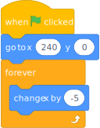
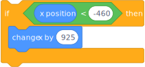
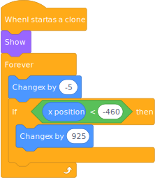
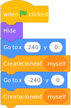
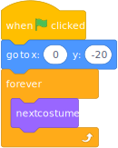

# Scrolling background

In some games, such as Mario, the player's character stays in the middle of the screen and the game moves around it. In this project we will see how that is done.

## Left-Right scroller starter project

Go to the user page https://scratch.mit.edu/users/LPPSteacher1/ and find the 'Left-Right Scroller Start' project. You can find it directly here;

> https://scratch.mit.edu/projects/863782680/editor

Open this project and remix it for yourself.

Notice that this project has one sprite containing the background.

## Get the background scrolling to the left

The first thing to do is make the background scroll to the the left with this script:

<table>
  <tr>
    <td>
      
    </td>
    <td>
      <pre>
When flag clicked
Go to x: [240] y: [0]
Forever
  Change x by [-5]
      </pre>
    </td>
  </tr>
</table>

This will get the background scrolling to the left but then it stops when it gets to the edge. To fix this, check its position after x has been changed by adding this inside the 'forever' loop and after the 'change x' block:

<table>
  <tr>
    <td>
      
    </td>
    <td>
      <pre>
If (x position) < [-460] then
  Change x by [925]
      </pre>
    </td>
  </tr>
</table>

## Joining it up

At the moment the backgorund is not complete. We need to have two copies of it and we can do that by using **clones**.

*Change* your script in three ways;

* Use  (`When I start as a clone`) instead of  (`When flag clicked`)
* Remove  (`Go to x: [240] y: [0]`)
* Add  at the start (`Show`)

It should now look like this;

<table>
  <tr>
    <td>
      
    </td>
    <td>
      <pre>
When I start as a clone
Show
Forever
  Change x by [-5]
  If (x position) < [-460] then
    Change x by [925]
      </pre>
    </td>
  </tr>
</table>

Then create a new script to create the two clones in the correct places;

<table>
  <tr>
    <td>
      
    </td>
    <td>
      <pre>
When flag clicked
  Hide
  Go to x [240] y [0]
  Create clone of (myself)
  Go to x [-240] y [0]
  Create clone of (myself)
      </pre>
    </td>
  </tr>
</table>

## Get a sprite runing along the road

Choose a new sprite to run along the road. It is best to choose a sprite with walking costumes, such as;

* Avery Walking
* Bear-walking
* Cat
* Dog2
* Griffin
* Hare
* Hippo1
* Jaime
* Lion
* Mouse1
* Parrot
* Penguin
* Pico walking
* Polar Bear
* Shark
* Shark2
* Unicorn Running

Add a script to this sprite to make to run through all the cosumes so that it looks as though it is running. Note that we do not need to actually move the sprite.

<table>
  <tr>
    <td>
      
    </td>
    <td>
      <pre>
When flag clicked
Go to x: [0] y: [-20]
Forever
  Next costume
      </pre>
    </td>
  </tr>
</table>

You might want to slow it down by adding a  (`Wait [0.5] seconds`) in the right place.

## Challenges

1. Can you control the scrolling by pressing a button? (For example, the right arrow)
2. After the first challenge, can you get the scrolling to go the other way if you press a different button? (For example, the left arrow)
